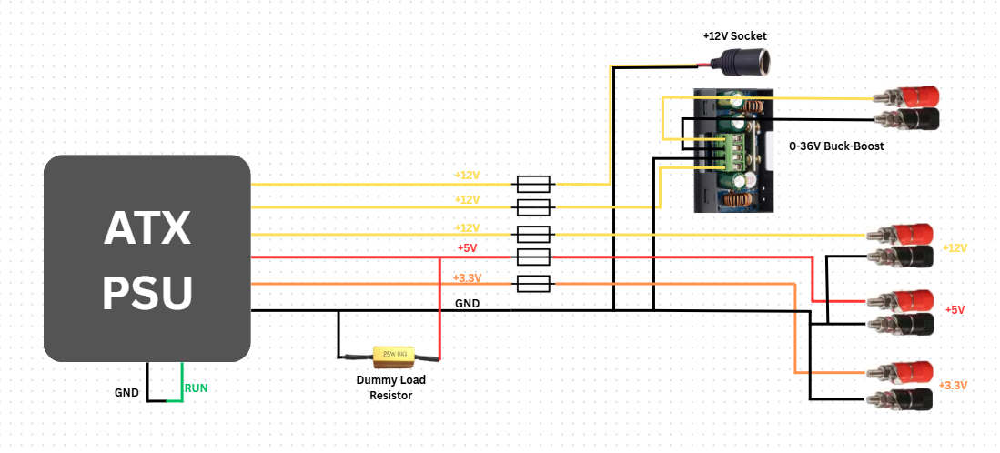
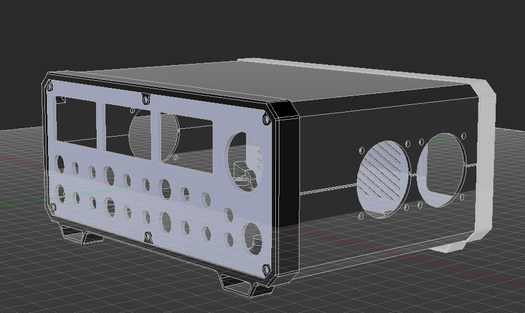
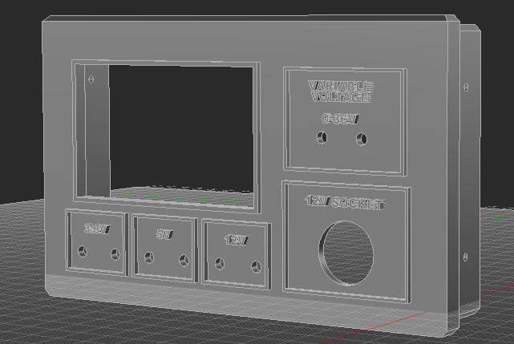
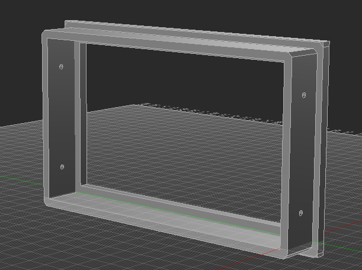
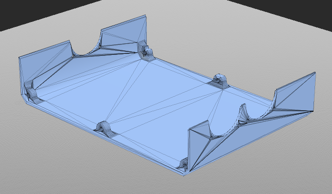
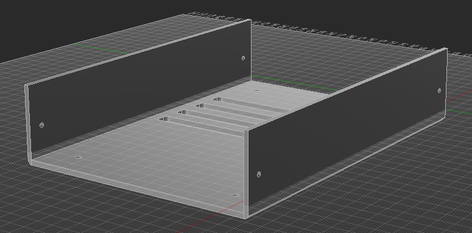

# RePSU - Repurposed Power Supply

**RePSU** is a project focused on giving an old, discarded ATX power supply a second life by converting it into a compact and functional lab bench power supply. The system provides 3.3V, 5V, and 12V outputs and fuse protection on each rail.

The build also includes several additional features such as a 0-36V variable voltage supply and a configurable 12V cigarette lighter socket.

The goal of RePSU is to turn otherwise wasted hardware into a practical electronics tool while keeping the project low-cost, reusable, and educational.

**NO CUSTOM PCB/SCHEMATIC/SOFTWARE**

## Schematic:

The system provides fixed 3.3V, 5V, and 12V outputs through the banana sockets, a configurable 12V cigarette lighter socket and last but not least, a 0-36V variable voltage & current supply using a DC Buck-Boost Converter.

The wiring is as below:

   

## CAD:

   

  
 

  
 

## Bill Of Materials:

| Part | Quantity | Link | Price |
|-|-|-|-|
| Variable Buck-Boost Converter | x1 | https://ar.aliexpress.com/item/1005007635502349.html | 15.61$ |
| Banana Sockets | x6 | https://ar.aliexpress.com/item/1005007170383731.html | 4.08$ / 10 Sockets |
|10 AMP Fuse + Fuse Holder | x6 | https://ar.aliexpress.com/item/1005002366366037.html | 1.63$ / Fuse |
| 12V Cigarette Socket | x1 | https://ar.aliexpress.com/item/1005007476823331.html | 4.36$ |
|Rubber Feet w/ Screws | x4 | https://ar.aliexpress.com/item/1005012536930473.html | 4.72$ / Pack|
| M3/M4 Heatset Inserts |x4|https://ar.aliexpress.com/item/1005010808279352.html| 3.93 $ / Pack |
|M3 Screws (M3x6) |x4|https://ar.aliexpress.com/item/1005007170017044.html| 1.91 $ / 50 Pieces|
| 10-ohm 25-W Dummy Load Resistor| x1 | https://ar.aliexpress.com/item/1005007810348834.html | 4.48$ / 2 Pieces |
| Second Hand ATX PSU | x1 | Buy from FB marketplace, Ebay or local sellers | ~40$ |

Prices are never constant on aliexpress. The above prices are the ones I saw when checking it out

**Note:** Newer ATX PSUs have inbuilt dummy load resistors. Check your model specs and confirm
**Estimated BOM Cost:** $48.87 USD, If including the ATX PSU and miscellaneous hardware such as wires ~$80 USD