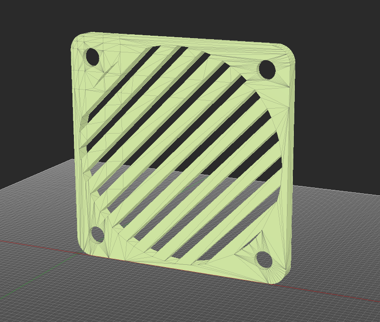
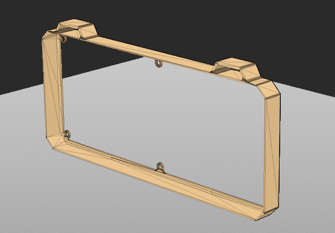

# RePSU - Repurposed Power Supply

**RePSU** is a project focused on giving an old, discarded ATX power supply a second life by converting it into a compact and functional lab bench power supply. The system provides 3.3V, 5V, and 12V outputs, with individual monitoring and protection for each rail.

The build also includes several additional features such as voltage/current displays, fused outputs, dedicated power buttons, cooling fans, MOSFET-based control, and an integrated 85W USB charging port.

The goal of RePSU is to turn otherwise wasted hardware into a practical electronics tool while keeping the project low-cost, reusable, and educational.

## CAD Enclosure:

   

  
 

  
 

  
 

## Bill Of Materials:

| Part | Quantity | Link | Price |
|-|-|-|-|
| Voltmeter/Ammeter Displays | x3 | https://www.aliexpress.com/item/1005008406350503.html | ~1.5$ / Display |
| Banana Sockets | x6 |  https://ar.aliexpress.com/item/1005003943304682.html | ~5$ / 10 Sockets |
|10 AMP Fuse + Fuse Holder | x3 | https://ar.aliexpress.com/item/4001144562333.html |~1.5$ / Fuse |
| Metal Push Button | x3 | https://ar.aliexpress.com/item/1005004765834557.html | ~1$ / Button |
| 85W USB Charger | x1 | https://www.aliexpress.com/item/1005007599829780.html | ~4$ / Charger Module + Fuse |
| 12v 40*40*10mm Fan | x3 | https://ar.aliexpress.com/item/32640103358.html | ~2$ / Fan |
| IRFZ44N N-Channel Mosfet | x3 | https://www.aliexpress.com/item/1005007038345855.html  | ~2.5$ / 10 IRFZ44N Mosfets |
|IRF9540 P-Channel Mosfet|x3|https://www.aliexpress.com/item/1005005945630765.html|~2.5$ / 10 IRF9540N |
| Second Hand ATX PSU | x1 | Buy from FB marketplace, ebay or local sellers | ~10-30$ |

**Estimated BOM Cost:** ~$35 USD, excluding the original ATX PSU and miscellaneous hardware
